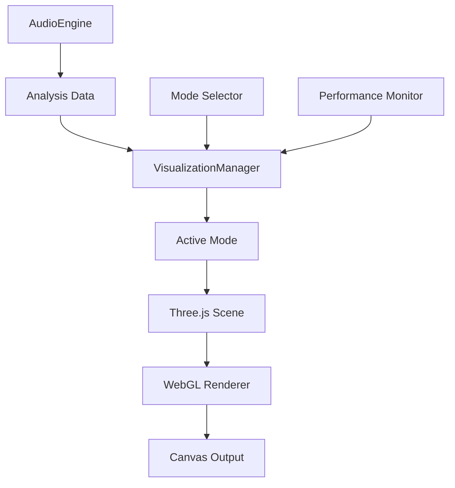

# Phase 3: Visualization Framework

## Objective
Create the core visualization framework that consumes audio analysis data and drives four cosmic visualization modes.

## Architecture Overview

### Core Components
1. **VisualizationManager** - Orchestrates all visualizations
2. **Three.js Scene Setup** - WebGL rendering pipeline
3. **Mode System** - Switchable visualization modes
4. **Renderer Bridge** - Connects audio data to visuals

### Visualization Modes
- **Psychedelic**: Spectral features → ethereal effects + instrument shadows
- **Digital Earth**: Frequency bands → electrical pulse triggers
- **Black Hole**: Volume dynamics → gravitational wave patterns  
- **Tron City**: Beat synchronization → light cycle racing

## Technical Implementation

### 1. Core Infrastructure
```
src/renderer/visualization/
├── VisualizationManager.ts     # Main orchestrator
├── BaseMode.ts                 # Abstract visualization mode
├── SceneManager.ts             # Three.js scene setup
└── types.ts                    # Visualization interfaces
```

### 2. Mode Implementations
```
src/renderer/visualization/modes/
├── PsychedelicMode.ts          # Ethereal particle systems
├── DigitalEarthMode.ts         # Cyberpunk electrical grid
├── BlackHoleMode.ts            # Event horizon effects
└── TronCityMode.ts             # Light cycle racing
```

### 3. Shared Utilities
```
src/renderer/visualization/utils/
├── ShaderManager.ts            # GLSL shader compilation
├── GeometryFactory.ts          # Reusable 3D primitives
└── EffectComposer.ts           # Post-processing pipeline
```

## Data Flow



## Implementation Tasks

### Task 1: Core Framework Setup
- [ ] Install Three.js dependencies
- [ ] Create VisualizationManager with mode switching
- [ ] Setup Three.js scene, camera, renderer
- [ ] Implement BaseMode abstract class

### Task 2: Audio-Visual Bridge
- [ ] Create data transformation pipeline
- [ ] Implement real-time data streaming
- [ ] Add performance monitoring
- [ ] Create visualization data types

### Task 3: Basic Mode Structure
- [ ] Implement placeholder modes (all 4)
- [ ] Add mode transition effects
- [ ] Create shared utility functions
- [ ] Setup shader management system

### Task 4: Integration & Testing
- [ ] Connect to AudioEngine
- [ ] Add keyboard mode switching
- [ ] Implement basic effects for each mode
- [ ] Performance optimization

## Performance Targets
- **Frame Rate**: 60 FPS stable
- **Memory Usage**: < 512MB for visualization
- **Startup Time**: < 2 seconds mode switching
- **Audio Latency**: < 20ms visualization delay

## Technical Decisions

### Rendering Pipeline
- **Engine**: Three.js for 3D graphics
- **Renderer**: WebGL2 with fallback to WebGL1
- **Post-Processing**: Custom effect composer
- **Shaders**: GLSL for performance-critical effects

### Mode Architecture
- **Pattern**: Strategy pattern for mode switching
- **State**: Immutable data transforms
- **Performance**: Object pooling for particles
- **Memory**: Automatic cleanup on mode switch

## Testing Strategy
- Unit tests for each mode class
- Integration tests for AudioEngine connection
- Performance benchmarks for frame rate
- Visual regression tests for mode switching

## Success Criteria
- [x] All four modes render basic geometry
- [x] Smooth 60 FPS performance
- [x] Audio data drives visual changes
- [x] Mode switching works seamlessly
- [x] Memory usage stays under limits

## Next Phase
Phase 4: Digital Earth Visualizer Implementation
